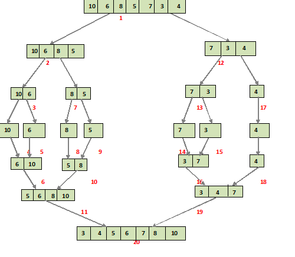

# 1. Introduction
   In this tutorial, we’ll have a look at the Merge Sort algorithm and its implementation in Java.

Merge sort is one of the most efficient sorting techniques, and it’s based on the “divide and conquer” paradigm.

---

# 2. The Algorithm
   Merge sort is a “divide and conquer” algorithm, wherein we first divide the problem into subproblems. When the solutions for the subproblems are ready, we combine them together to get the final solution to the problem.

We can easily implement this algorithm using recursion, as we deal with the subproblems rather than the main problem.

We can describe the algorithm as the following 2 step process:

Divide: In this step, we divide the input array into 2 halves, the pivot being the midpoint of the array. This step is carried out recursively for all the half arrays until there are no more half arrays to divide.
Conquer: In this step, we sort and merge the divided arrays from bottom to top and get the sorted array.
The following diagram shows the complete merge sort process for an example array {10, 6, 8, 5, 7, 3, 4}.

If we take a closer look at the diagram, we can see that the array is recursively divided into two halves until the size becomes 1. Once the size becomes 1, the merge processes comes into action and starts merging arrays back while sorting:



---

# 3. Implementation
   For the implementation, we’ll write a mergeSort function that takes in the input array and its length as the parameters. This will be a recursive function, so we need the base and the recursive conditions.

The base condition checks if the array length is 1 and it will just return. For the rest of the cases, the recursive call will be executed.

For the recursive case, we get the middle index and create two temporary arrays, l[] and r[]. Then we call the mergeSort function recursively for both the sub-arrays:
```java
public static void mergeSort(int[] a, int n) {
if (n < 2) {
return;
}
int mid = n / 2;
int[] l = new int[mid];
int[] r = new int[n - mid];

    for (int i = 0; i < mid; i++) {
        l[i] = a[i];
    }
    for (int i = mid; i < n; i++) {
        r[i - mid] = a[i];
    }
    mergeSort(l, mid);
    mergeSort(r, n - mid);

    merge(a, l, r, mid, n - mid);
}
```

---

Next, we call the merge function, which takes in the input and both the sub-arrays, as well as the start and end indices of both the sub arrays.

The merge function compares the elements of both sub-arrays one by one and places the smaller element into the input array.

When we reach the end of one of the sub-arrays, the rest of the elements from the other array are copied into the input array, thereby giving us the final sorted array:
```java
public static void merge(
int[] a, int[] l, int[] r, int left, int right) {

    int i = 0, j = 0, k = 0;
    while (i < left && j < right) {
        if (l[i] <= r[j]) {
            a[k++] = l[i++];
        }
        else {
            a[k++] = r[j++];
        }
    }
    while (i < left) {
        a[k++] = l[i++];
    }
    while (j < right) {
        a[k++] = r[j++];
    }
}
```
The test for the program is:

```java
public static void main(String[] args) {
    int[] randomOrderList = {5, 1, 6, 2, 3, 4};

    System.out.println("Random List: " + Arrays.toString(randomOrderList));

    mergeSort(randomOrderList, randomOrderList.length);

    System.out.println("Sorted List: " + Arrays.toString(randomOrderList));
}
```
```terminal
Random List: [5, 1, 6, 2, 3, 4]
Sorted List: [1, 2, 3, 4, 5, 6]
```

---

# 4. Complexity
   As merge sort is a recursive algorithm, the time complexity can be expressed as the following recursive relation:

```terminal
T(n) = 2T(n/2) + O(n)
```

2T(n/2) corresponds to the time required to sort the sub-arrays, and O(n) is the time to merge the entire array.

When solved, the time complexity will come to O(nLogn).

This is true for the worst, average, and best cases, since it’ll always divide the array into two and then merge.

The space complexity of the algorithm is O(n), as we’re creating temporary arrays in every recursive call.